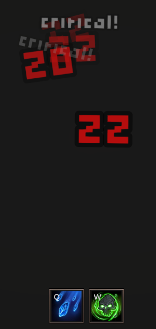

# RPG Essentials - Unity Project

A comprehensive Unity RPG mechanics system implementation featuring core gameplay systems essential for indie RPG games.

## 🎮 Project Overview

This project implements essential RPG mechanics using Unity's modern systems and best practices. It serves as a foundation for indie RPG game development, covering all the core systems needed to create engaging role-playing experiences.

This is the content that we develop together in the course: https://www.udemy.com/course/unity-essentials-rpg-mechanics-for-indie-games/?referralCode=2B25C03C0BDD34008922

## ✨ Features

### 🎯 Attribute Points & Modifiers System
<div align="center">
  
</div>

- **Flexible Attribute System**: Base values with modifier support
- **Modifier Types**: Flat bonuses and percentage multipliers
- **Dynamic Calculations**: Real-time attribute recalculation
- **Point Distribution**: Manual attribute point allocation system

### ⚔️ Abilities System
<div align="center">
  
</div>

- **Multi-Level Abilities**: Progressive ability scaling
- **Cooldown Management**: Async cooldown system with visual feedback
- **Damage Calculation**: Min/max damage ranges with critical hit support
- **Scriptable Object Based**: Easy ability creation and modification

### 🛡️ Damage Calculation System
<div align="center">
  
</div>

- **Attribute-Based Damage**: Damage scales with character attributes
- **Critical Hit System**: Configurable critical chance and damage multipliers
- **Combat Utilities**: Centralized damage calculation functions
- **Visual Feedback**: Damage popup system with critical hit indicators

### 📈 Experience Points System
<div align="center">
  
</div>

- **Level Progression**: Configurable experience tables
- **Event-Driven**: Experience change notifications
- **Level-Up Logic**: Automatic level progression
- **Max Level Support**: Proper handling of maximum level caps

### 🎒 Inventory System
<div align="center">
  
</div>

- **Slot-Based Inventory**: Flexible capacity management
- **Item Stacking**: Automatic item stacking for stackable items
- **Drag & Drop**: Item swapping between slots
- **Item Management**: Add, remove, and organize items efficiently

### 📋 Quest System
<div align="center">
  
</div>

- **Scriptable Quest Definitions**: Easy quest creation and management
- **Task-Based Structure**: Multi-task quest support
- **Quest Tracking**: Progress monitoring and completion handling
- **Modular Design**: Extensible quest system architecture

## 🏗️ Technical Implementation

### Core Systems Architecture

The project follows a modular architecture with clear separation of concerns:

- **Scriptable Objects**: Used for data definitions (abilities, quests, experience tables)
- **Event-Driven Design**: Systems communicate through events for loose coupling
- **Async/Await Patterns**: Modern C# async patterns for cooldowns and timing
- **Component-Based**: Unity's component system for flexible game object composition

### Key Technologies Used

- **Unity 2023.x**: Latest Unity features and systems
- **Universal Render Pipeline (URP)**: Modern rendering pipeline
- **Input System**: New Unity Input System for better input handling
- **DOTween**: Smooth animations and transitions
- **Custom Damage Popup**: Visual feedback system for combat

## 🎨 Visual Features

### Ability System UI
<div style="display: flex; align-items: center; gap: 20px;">
  
  <div>
    <h3>Vertical Ability Layout</h3>
    <p>The ability system features a clean vertical layout that provides excellent visual hierarchy and user experience. The interface includes:</p>
    <ul>
      <li>Clear ability icons and descriptions</li>
      <li>Cooldown visual indicators</li>
      <li>Level progression display</li>
      <li>Intuitive button interactions</li>
    </ul>
  </div>
</div>

## 🚀 Getting Started

### Prerequisites

- Unity 2023.x or later
- Visual Studio or preferred C# IDE
- Basic knowledge of Unity and C#

### Installation

1. Clone or download this repository
2. Open the project in Unity
3. Ensure all packages are imported correctly
4. Open the main scene to explore the systems

### Usage

Each system is designed to be modular and can be integrated into existing projects:

1. **Copy the relevant Scripts folders** for the systems you need
2. **Import the Scriptable Objects** for data definitions
3. **Set up the UI prefabs** for visual components
4. **Configure the systems** through the Unity Inspector

## 📁 Project Structure

```
Assets/
├── 0 - Attributes Point - Distributing Points/    # Attribute point allocation
├── 1 - Attributes Poins - Modifiers/             # Attribute modifier system
├── 2 - Abilities/                                 # Ability definitions and logic
├── 3 - Damage Calculation/                         # Combat and damage systems
├── 4 - Experience Points/                         # XP and leveling system
├── 5 - Inventory/                                 # Inventory management
├── 6 - Quests/                                    # Quest system implementation
├── Resources/                                     # Images and assets
├── Scenes/                                        # Unity scenes
└── Settings/                                      # Project settings
```

## 🎓 Learning Outcomes

This project demonstrates:

- **Modern Unity Development**: Latest Unity features and best practices
- **System Design**: How to create modular, extensible game systems
- **C# Advanced Features**: Async/await, events, and modern C# patterns
- **UI/UX Design**: Creating intuitive game interfaces
- **Performance Optimization**: Efficient system implementations

## 🤝 Contributing

This project serves as a learning resource and foundation for RPG game development. Feel free to:

- Fork the project for your own games
- Submit issues for bugs or improvements
- Share your implementations and variations

## 📄 License

This project is created for educational purposes. Please respect the original course materials and use responsibly in your own projects.

## 🙏 Acknowledgments

- Based on the Unity Essentials RPG Mechanics course
- Built with Unity's modern systems and best practices
- Designed for indie game developers and RPG enthusiasts

---

**Happy Game Development!** 🎮✨
